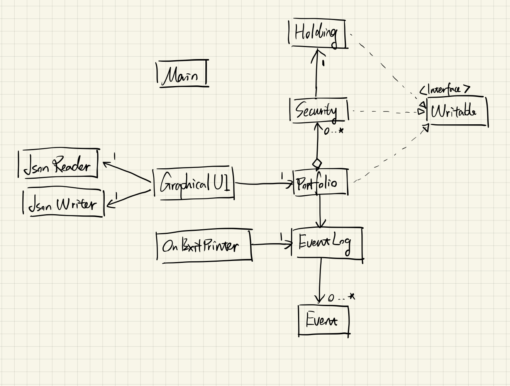

# Simple spot trade simulator

- **What will the application do?**  
    - Simulates the process of simple spot trading provided by any exchanges / brokers;
    - Sets any (valid) preferred initial fund to make transactions of securities;
    - Allows users to buy / sell any (valid) amount of securities with specified market price;
    - Evaluates performance of each user's portfolio by indicators, i.e., *rate of return*. 
- **Who will use it?**
    - Users without experience who intend to study trading;
    - Traders who intend to practice spot trading without sufficient funding; 
- **Why is this project of interest to you?**
    - **Reproducibility**: Even though the topic of this project is restricted within simple spot trading, similar framework also applies to options and futures;
    - This project allows one to play around with the market for free. And we won't lose anything from it (nor would we get anything). 

## User stories
- As a user, I want to be able to add any amount of cash;
- As a user, I want to be able to buy and sell a security for a certain price;
- As a user, I want to be able to measure the performance of my portfolio;
- As a user, I want to be able to see the return rate for each sell; 
- As a user, I want to be able to save my current state of portfolio;
- As a user, I want to be able to retrieve the state of portfolio from the last saving;

## Phase 4: Task 2
```
Fri Nov 26 10:30:29 PST 2021
20000 cash added to portfolio
Fri Nov 26 10:30:31 PST 2021
20000 cash added to portfolio
Fri Nov 26 10:30:37 PST 2021
Action failed: Security not found
Fri Nov 26 10:30:37 PST 2021
19999: 10 price, 10 quantity bought
Fri Nov 26 10:30:41 PST 2021
Action failed: Security not found
Fri Nov 26 10:30:41 PST 2021
213: 213 price, 21 quantity bought
Fri Nov 26 10:30:45 PST 2021
Action failed: Security not found
Fri Nov 26 10:30:53 PST 2021
19999: 21 price, 2 quantity sold
Fri Nov 26 10:31:01 PST 2021
IO: Portfolio loaded
Fri Nov 26 10:31:08 PST 2021
APPL: 20 price, 10 quantity bought
Fri Nov 26 10:31:12 PST 2021
IO: Portfolio saved
```
## Phase 4: Task 3



**Improvements in refactoring**
- Prices and quantities of one security is represented by two one-to-one lists in `Holding`. The two lists can be refactored into a `Map` with more nested design and not changing the functionality.
- Method `jsonToPortfolio()` in `JsonReader` class has poor readability and testability with one `for` loop inside another. We can refactor the inner `for` loop as an independent helper method. 